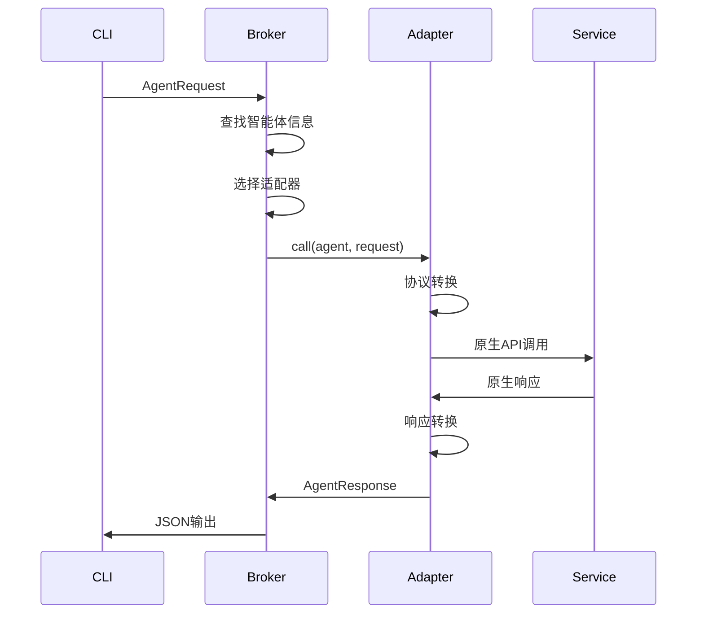

# 智能体适配器开发指南

适配器是 CLI-API 的核心扩展机制，用于将现有的智能体服务适配到 CLI-Agent Protocol (CAP)。

## 🏗️ 适配器架构

### 核心接口

所有适配器都需要实现 `AgentAdapter` trait：

```rust
#[async_trait::async_trait]
pub trait AgentAdapter: Send + Sync {
    /// 调用智能体
    async fn call(&self, agent: &AgentInfo, request: &AgentRequest) -> CapResult<AgentResponse>;
    
    /// 测试连接
    async fn test_connection(&self, agent: &AgentInfo) -> CapResult<bool>;
}
```

### 适配器生命周期



## 🔌 开发新适配器

### 1. 项目结构

```
crates/adapters/my-adapter/
├── Cargo.toml
├── src/
│   ├── lib.rs          # 适配器实现
│   ├── client.rs       # API客户端
│   └── types.rs        # 类型定义
└── examples/
    └── usage.rs        # 使用示例
```

### 2. Cargo.toml 配置

```toml
[package]
name = "my-adapter"
version.workspace = true
edition.workspace = true
license.workspace = true
description = "My Service adapter for CLI-API"

[dependencies]
cap-protocol = { path = "../../cap-protocol" }
async-trait = "0.1"
serde.workspace = true
serde_json.workspace = true
tokio.workspace = true
anyhow.workspace = true
thiserror.workspace = true
reqwest.workspace = true
```

### 3. 基础实现模板

```rust
// src/lib.rs
use async_trait::async_trait;
use cap_protocol::*;
use serde::{Deserialize, Serialize};
use std::collections::HashMap;

pub struct MyAdapter {
    client: MyClient,
    config: AdapterConfig,
}

pub struct AdapterConfig {
    pub timeout: u64,
    pub retry_count: u32,
    pub base_url: Option<String>,
}

impl MyAdapter {
    pub fn new(config: AdapterConfig) -> Self {
        Self {
            client: MyClient::new(config.base_url.clone()),
            config,
        }
    }
    
    // 私有方法：协议转换
    async fn convert_request(&self, agent: &AgentInfo, request: &AgentRequest) -> Result<MyServiceRequest, CapError> {
        match request.command.as_str() {
            "chat" => self.convert_chat_request(request),
            "summarize" => self.convert_summarize_request(request),
            _ => Err(CapError::CommandNotFound(request.command.clone())),
        }
    }
    
    async fn convert_chat_request(&self, request: &AgentRequest) -> Result<MyServiceRequest, CapError> {
        let message = request.args
            .get(0)
            .or_else(|| request.input.as_ref())
            .ok_or_else(|| CapError::ProtocolError("Missing message".to_string()))?;
        
        Ok(MyServiceRequest {
            action: "chat".to_string(),
            data: MyRequestData::Chat {
                message: message.clone(),
                context: request.context.clone(),
            },
        })
    }
    
    async fn convert_response(&self, response: MyServiceResponse) -> Result<AgentResponse, CapError> {
        Ok(AgentResponse {
            id: response.request_id,
            success: response.status == "success",
            output: response.result,
            error: response.error,
            metadata: response.metadata.unwrap_or_default(),
            execution_time_ms: 0, // 将由Broker设置
        })
    }
}

#[async_trait]
impl super::AgentAdapter for MyAdapter {
    async fn call(&self, agent: &AgentInfo, request: &AgentRequest) -> CapResult<AgentResponse> {
        // 1. 转换请求格式
        let service_request = self.convert_request(agent, request).await?;
        
        // 2. 调用原生API
        let service_response = self.client
            .call(&agent.endpoint, &service_request)
            .await
            .map_err(|e| CapError::NetworkError(e.to_string()))?;
        
        // 3. 转换响应格式  
        let response = self.convert_response(service_response).await?;
        
        Ok(response)
    }
    
    async fn test_connection(&self, agent: &AgentInfo) -> CapResult<bool> {
        match self.client.health_check(&agent.endpoint).await {
            Ok(_) => Ok(true),
            Err(_) => Ok(false),
        }
    }
}

// 服务特定的类型定义
#[derive(Serialize)]
struct MyServiceRequest {
    action: String,
    data: MyRequestData,
}

#[derive(Serialize)]
#[serde(tag = "type")]
enum MyRequestData {
    Chat { message: String, context: Option<HashMap<String, serde_json::Value>> },
    Summarize { text: String, length: Option<usize> },
}

#[derive(Deserialize)]
struct MyServiceResponse {
    request_id: uuid::Uuid,
    status: String,
    result: Option<String>,
    error: Option<String>,
    metadata: Option<HashMap<String, String>>,
}
```

### 4. HTTP 客户端实现

```rust
// src/client.rs
use anyhow::Result;
use serde::{Serialize, de::DeserializeOwned};

pub struct MyClient {
    client: reqwest::Client,
    base_url: Option<String>,
}

impl MyClient {
    pub fn new(base_url: Option<String>) -> Self {
        Self {
            client: reqwest::Client::builder()
                .timeout(std::time::Duration::from_secs(30))
                .build()
                .expect("Failed to create HTTP client"),
            base_url,
        }
    }
    
    pub async fn call<Req, Res>(&self, endpoint: &str, request: &Req) -> Result<Res>
    where
        Req: Serialize,
        Res: DeserializeOwned,
    {
        let url = format!("{}/api/v1/call", endpoint);
        
        let response = self.client
            .post(&url)
            .header("Content-Type", "application/json")
            .json(request)
            .send()
            .await?
            .error_for_status()?
            .json::<Res>()
            .await?;
            
        Ok(response)
    }
    
    pub async fn health_check(&self, endpoint: &str) -> Result<()> {
        let url = format!("{}/health", endpoint);
        
        self.client
            .get(&url)
            .send()
            .await?
            .error_for_status()?;
            
        Ok(())
    }
}
```

## 🧪 测试适配器

### 单元测试

```rust
#[cfg(test)]
mod tests {
    use super::*;
    use cap_protocol::*;
    use uuid::Uuid;

    #[tokio::test]
    async fn test_chat_conversion() {
        let adapter = MyAdapter::new(AdapterConfig {
            timeout: 30,
            retry_count: 3,
            base_url: None,
        });
        
        let request = AgentRequest {
            id: Uuid::new_v4(),
            agent_id: "test".to_string(),
            command: "chat".to_string(),
            args: vec!["Hello".to_string()],
            input: None,
            context: None,
            metadata: HashMap::new(),
        };
        
        let result = adapter.convert_request(&mock_agent(), &request).await;
        assert!(result.is_ok());
    }
    
    fn mock_agent() -> AgentInfo {
        AgentInfo {
            id: "test".to_string(),
            name: "Test Agent".to_string(),
            description: "Test".to_string(),
            version: "1.0.0".to_string(),
            provider: "test".to_string(),
            commands: vec![],
            capabilities: vec![],
            endpoint: "http://localhost:3000".to_string(),
            protocol: ProtocolType::Rest,
            auth: None,
        }
    }
}
```

### 集成测试

```rust
// tests/integration.rs
use cap_protocol::*;
use my_adapter::*;

#[tokio::test]
#[ignore] // 需要真实服务
async fn test_real_service_call() {
    let adapter = MyAdapter::new(AdapterConfig::default());
    
    let agent = AgentInfo {
        id: "real-service".to_string(),
        endpoint: "https://my-service.com".to_string(),
        // ... 其他字段
    };
    
    let request = AgentRequest {
        // ... 请求数据
    };
    
    let response = adapter.call(&agent, &request).await;
    assert!(response.is_ok());
}
```

## 📋 注册适配器

### 1. 在 Broker 中注册

```rust
// crates/broker/src/main.rs
impl Broker {
    pub fn new(hub_url: String) -> Self {
        let mut adapters: HashMap<ProtocolType, Box<dyn AgentAdapter>> = HashMap::new();
        
        // 注册新适配器
        adapters.insert(
            ProtocolType::Rest, 
            Box::new(MyAdapter::new(AdapterConfig::default()))
        );
        
        // ... 其他适配器
        
        Self { hub_url, adapters, agent_cache: HashMap::new() }
    }
}
```

### 2. 添加到工作空间

```toml
# Cargo.toml
[workspace]
members = [
    "crates/cli-api",
    "crates/cap-protocol", 
    "crates/hub",
    "crates/broker",
    "crates/adapters/*",
    "crates/adapters/my-adapter",  # 新增
]
```

### 3. 更新 Broker 依赖

```toml
# crates/broker/Cargo.toml
[dependencies]
my-adapter = { path = "../adapters/my-adapter" }
```

## 🎯 最佳实践

### 1. 错误处理

```rust
impl MyAdapter {
    async fn handle_api_error(&self, error: reqwest::Error) -> CapError {
        if error.is_timeout() {
            CapError::NetworkError("Request timeout".to_string())
        } else if error.is_connect() {
            CapError::NetworkError("Connection failed".to_string())
        } else {
            CapError::ProtocolError(format!("API error: {}", error))
        }
    }
}
```

### 2. 重试机制

```rust
use tokio_retry::{strategy::ExponentialBackoff, Retry};

impl MyAdapter {
    async fn call_with_retry<T>(&self, operation: impl Fn() -> T) -> Result<T> {
        let retry_strategy = ExponentialBackoff::from_millis(100)
            .max_delay(Duration::from_secs(2))
            .take(self.config.retry_count as usize);
        
        Retry::spawn(retry_strategy, operation).await
    }
}
```

### 3. 配置管理

```rust
#[derive(Deserialize)]
pub struct AdapterConfig {
    #[serde(default = "default_timeout")]
    pub timeout: u64,
    #[serde(default = "default_retry_count")] 
    pub retry_count: u32,
    pub base_url: Option<String>,
    pub auth: Option<AuthConfig>,
}

fn default_timeout() -> u64 { 30 }
fn default_retry_count() -> u32 { 3 }

impl Default for AdapterConfig {
    fn default() -> Self {
        Self {
            timeout: default_timeout(),
            retry_count: default_retry_count(),
            base_url: None,
            auth: None,
        }
    }
}
```

### 4. 监控和日志

```rust
use tracing::{info, warn, error, instrument};

impl MyAdapter {
    #[instrument(skip(self, request))]
    async fn call(&self, agent: &AgentInfo, request: &AgentRequest) -> CapResult<AgentResponse> {
        info!("Calling agent {} with command {}", agent.id, request.command);
        
        let start = std::time::Instant::now();
        let result = self.do_call(agent, request).await;
        let duration = start.elapsed();
        
        match &result {
            Ok(_) => info!("Call completed in {:?}", duration),
            Err(e) => error!("Call failed: {}", e),
        }
        
        result
    }
}
```

## 📚 现有适配器参考

可以参考以下已实现的适配器：

- [OpenAI 适配器](openai.md) - REST API 适配器示例
- [MCP 适配器](mcp.md) - WebSocket/JSON-RPC 适配器示例
- [Agent Protocol 适配器](agent-protocol.md) - 标准协议适配器

---

🔗 **相关资源**
- [CAP 协议规范](../protocol/README.md)
- [Broker 开发指南](../broker/README.md)
- [测试指南](../development/testing.md)